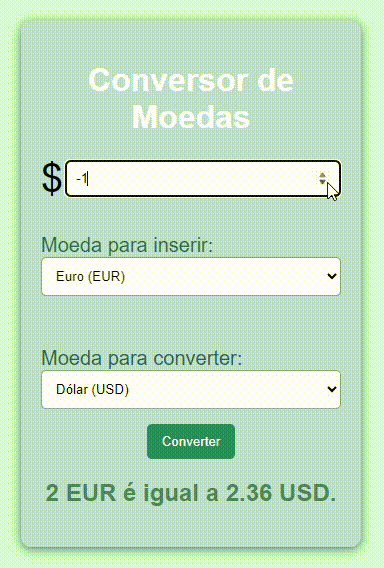

# 🌍 Conversor de Moedas

## 🌟 indiíe

* [Descrição](#descrição)
* [Funcionalidades](#📚-funcionalidades)
* [Tecnologias Utilizadas](#⚙️-tecnologias-utilizadas)
* [Como Usar](#🚀-como-usar)
* [Realize Conversão](#realize-conversão)
* [Exemplo de Uso](#💡-exemplo-de-uso)
* [Estrutura do Projeto](#🗂️-estrutura-do-projeto)
* [Resultado](#🎨-resultado)
* [Contibuições](#🤝-contribuições)

## 🛠️ Descrição

Bem-vindo ao Conversor de Moedas! Este projeto é uma aplicação simples e intuitiva que permite converter entre Dólar (USD), Euro (EUR) e Real (BRL). Se você está planejando uma viagem, fazendo compras internacionais ou apenas curioso sobre taxas de câmbio, este conversor é a ferramenta ideal!

## 📚 Funcionalidades
- Conversão em Tempo Real: Insira um valor e veja a conversão instantaneamente.
- Seleção de Moedas: Escolha entre Dólar, Euro e Real com um menu dropdown fácil de usar.
- Interface Amigável: Design responsivo e moderno para uma experiência de usuário agradável.

## ⚙️ Tecnologias Utilizadas

* HTML: Estrutura da página para uma apresentação clara.

* CSS: Estilização e design responsivo para uma interface atraente.

* JavaScript: Lógica de conversão de moedas, garantindo cálculos precisos e instantâneos.

## 🚀 Como Usar
Clone o Repositório: Baixe os arquivos ou clone o repositório em sua máquina.

* Copiar código
git clone https://github.com/Evellincruz/conver.moedas.git

Abra o Arquivo HTML: Execute o index.html em seu navegador de preferência.

## 🔧 Realize Conversão:

- Digite o valor que deseja converter.
- Selecione a moeda de origem (Dólar, Euro ou Real).
- Selecione a moeda de destino.
- Clique em "Converter" e veja o resultado!

## 💡 Exemplo de Uso
"Imagine que você deseja saber quanto 100 USD equivale em Euros:

1- Insira 100 no campo de valor.
2- Selecione Dólar (USD) como moeda de origem.
3- Selecione Euro (EUR) como moeda de destino.
4- Clique em "Converter" para visualizar a conversão."

### 🌐  Projeto/conversor-moedas

> index.html:  Página principal com a estrutura do conversor.

> index.css:    Arquivo de estilos que define a aparência.

> moed.js:      Lógica de conversão que faz os cálculos.

## 🎨 Resultado

## 🤝 Contribuições
Tivemos ajuda do nosso professor Leonardo, para desenvolver está tividade, realizamos aulas, colhemos informações, e utlizamos IA (Para a correção de textos e erros nos códigos) para a realização do projeto.